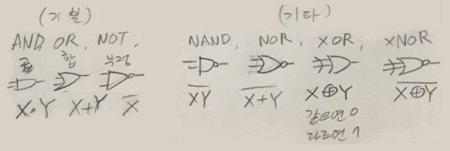
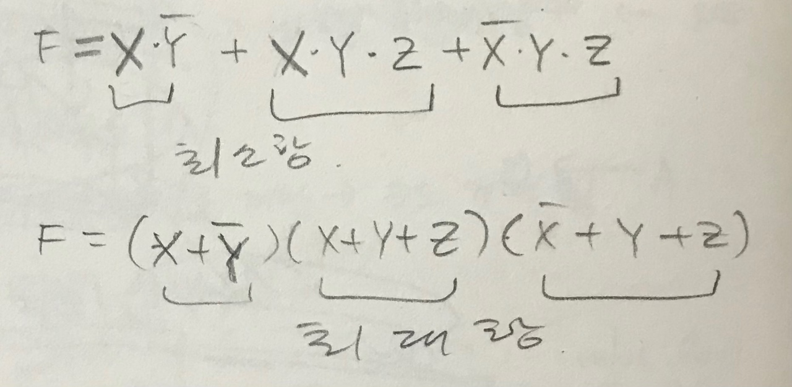

# TIL 2021-08-30

## 방통대 컴퓨터구조 1강 강의 정리

- 2장 디지털 논리회로
  - 컴퓨터 구성 기본회로
  - 2진 노리게이트
  - 집적회로(IC: Integrated Circuits)
    - 조합 회로: 저장요소 X => F/F(flipflop) X (ex. 가산기, 디코더 - 멀티플렉서)
    - 순서 회로: 저장요소 O => F/F O (ex. 레지스터, 카운터)
  - 논리게이트: 2진 정보 논리 연산 수행
    
  - 불대수(Boolean Algebra)
    - 불함수
    - 
    - 표현
      - 풀함수와 논리회로도 => 진리표
      - 진리표
        - 진리표는 하나만 존재
        - 동일 진리표의 불함수/논리회로도는 여러개
      - 불함수의 간소화 방법
        - 대수적 방법: 기본 공식 이용(정규형 부울함수 -> 표준형 부울함수)
        - 도표 이용: 카르노 도표
        - 테이블 이용

## 노드js 교과서 9장

- 익스프레스 nodebird sns 서비스 만들기 노드 패키지 설치까지만 함
