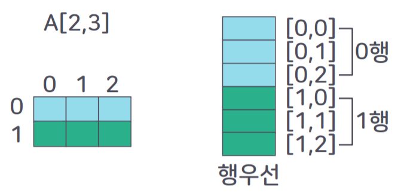
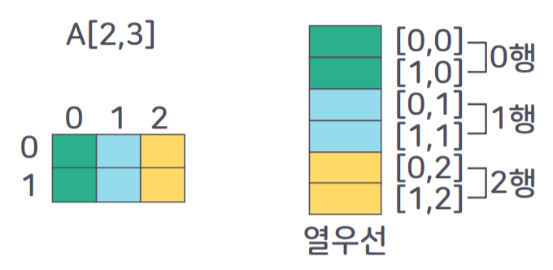
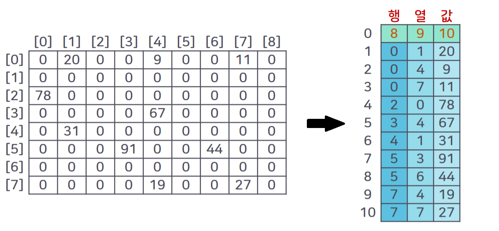

# TIL 2021-09-01

## 걸스인텍 DEV LIFE: 개발자 언니들의 커리어 이야기

#### 1st 세션

- 평소 공부법
  - 업무 받으면 그걸로 공부하는 스타일 -> 업무에 바로 활용할 수 있도록 깊이 있게
  - 혼자 공부하면 비효율적, 부정확한 정보 알수도 -> 스터디가 도움(외부에서 다양한 분야 개발자 만나서 스터디, 내부스터디로 배워온거 공유)
  - 어떤걸 공부할지 찾는 것도 문제 -> 사수, 동료에게 조언 구하기, 외부 네트워킹 모임에서 스터디(혼자 하기 힘든 두꺼운 책 보기 등)
- 동기부여 포인트
  - 성취감이 중요. 크지 않더라도 뭐 하나라도 도와주고 칭찬받는 것 정도로도 ok.
  - 바로 구현하고 받는 유저 반응이 재밌음
  - 공부했던 게 실무에 나올 때
  - 나의 동기부여가 뭔지를 아는 게 중요
- 회사에서 힘든 점
  - 끊임없이 공부해야 하고 나보다 늦게 입사했는데 더 잘하는 거 볼때, 도태된다고 느낄 때
  - 다들 비슷하게 내가 뒤처지는거 아닌가 생각하고 있음. 내려놓는 게 필요
- 회사에서 가장 만족하는 점
  - AWS Korea
    - 독특한 문화를 유지하려고 다같이 노력함
    - 공정한 평가 unbiased
  - 뱅크샐러드
    - 효율적인 협업에 대한 고민
    - 테크스펙 - 개발 전 자세한 문서화

#### 2nd 세션

- 일하면서 업무에 필요한 공부, 업무에 바로 쓸 수 있는 공부 하기
- 이직의 기준
  - 회사에서 할 수 있는 게 없다는 판단이 확실할 때(시니어가 부족함, 트래픽이 부족함)
  - 빨리 성장할 수 있는 회사
  - 더 이상 회사에서 성장한다고 느끼지 못할 때

#### Q&A 세션

- 다시 태어나도 개발자?
  - 영임: 개발자가 힙하면 할 것
  - 선숙: 재밌는게 너무 많아. 안해본거 해보고 싶어. 지금 고른다면 여행 컬럼니스트.
  - 나영: 뭔가 만드는 데에는 끝판왕이라서. 근데 들어보니 세상에 재밌는게 많네.
  - 지선: 내 실력으로 제대로 평가받을 수 있는 직업이어서.
- 내가 개발을 정말 못한다고 생각한 적이 있다?
  - 지선: 항상 내 산출물에 부족함을 느낌. 주변에 잘하는 사람 너무 많음. 반강제적으로 공부 하게되는 동기가 됨
  - 나영: 내가 짠 코드 내가 다시 보면서 현타올 때. 사수와 대화하다 이야기가 이해 안되거나 대화가 끊길 때.
  - 영임: 공학적으로 뛰어난 사람은 엄청 많음. 나는 개발을 잘 하는 사람보다는 서비스가 잘 굴러갈 수 있게 만들어주는 사람.
  - 선숙: 3-4년 전 짠 코드에 대한 질문이 갑자기 들어올 때. 근데 막상 보면 내가 왜 이렇게 짰는지, 요구사항이 뭐였는지 생각 남. 남의 코드 보면서 감탄할 때. 공부해야 되겠다 생각하게 되는 듯.
- 나이가 중요한지?
  - 지선: 나이, 연차 상관없이
  - 선숙: 오히려 연차 높은 사람 엔지니어로 매니징할 때 도움 받을 수 있어서 좋았음. 수평적 호칭 사용하고, 나이는 큰 허들이 되지 않음.
- 이 자리에 있기까지 나만의 루틴
  - 나영: 주니어때부터 블로그 2주에 한번씩 써오고 있음. 공부하는 데 있어서 천천히 꾸준히 성장하는 데 많은 도움이 됨. (코드랑 글 쓰는 건 다를 것 같은데 어떤 식으로 쓰는지?) 글을 예쁘게 쓰는 것 보다 습득한 지식을 구조적으로 잘짜서 쓰는 법을 고민. html 구조 짜듯이.
  - 선숙: 하루 업무를 매일 체계적으로 정리하기. 업무 시작 전에 오늘 해야하는 것, 집중적으로 해야 하는 것.
- 업무의 우선순위를 어떻게 정하는지?
  - 지선: 모든 일이 다 ASAP. 정말 서비스가 난리가 난건지, 그냥 빨리 보고싶은건지 센스로 빨리 파악하는 게 중요. 그 다음은 데드라인이 정확히 있는 일들.
  - 영임: 계획성 없고 게으른 사람이라 루틴이 딱히 없음. 회사에서의 우선순위는 명확한 편. 4분면으로 나눠서 태스크의 우선순위. 남이 부탁했는데 빨리 할 수 있는 걸 가장 먼저, 빨리 못하면 빨리 포워딩.
  - 사회자: ASAP이라고 붙여도 다시 한번 언제까지 필요한 건지 확인해보고 우선순위 정하는 것도 방법
- 나에게 개발이란?
  - 영임: 적당히 재미있는 먹고 살 수 있는 직업. 재일 재밌는건 넷플릭스 시청. 개발하며 문제를 푸는 재미가 있고, 무엇보다 보상이 쎔.
  - 선숙: 내가 컨트롤 할 수 있는 유일한 것.
  - 나영: 새로운 사고를 할 수 있게 도와주는 도구.
  - 지선: 도와주는 수단이자 공감해줄 수 있는 수단. 프로이직러로서 내 코드를 누가 볼 때 최대한 자세히 상황을 주석에 남겨둠. 예를 들어 이건 별로 하고 싶지 않은데 누구팀장이 하라고 해서 일단 하는데 몇번째 줄이 문제가 될 것 같으니 고치게 된다면 그 부분을 집중해서 봐주고 개선해주세요.
- 마지막 한마디
  - 선숙: 여기 있는 우리를 너무 대단하게 생각해서 저 자리에 못갈거라고 생각하지 않으면 좋겠다. 나는 평균에서 평균 조금 이하라고 생각함. 두려워하지 말고, 이렇게 되지 못할거라는 생각을 아예 하지 말고 도전했으면.
  - 영임: 개발자 문화 중에 천재 신화, 전혀 아님. 직업으로서의 개발자 가능함. 모두가 엔지니어적으로 매우 뛰어날 필요도 없음. 해보고 싶다면 누구나 도전해볼 수 있는 직업. 여자 매니저가 아직은 많지 않아서 가능고 길게 은퇴까지 개발자로 일하는 게 목표. 이런 분들이 더 많아졌으면.

## 방통대 자료구조 2강 강의 정리

- 배열
  - 연속된 저장 위치, 순서와 관련된 자료구조
  - <index, value> 쌍의 집합
  - **원소의 메모리 공간의 물리적 위치를 순서적으로 결정**
  - **배열의 순서==메모리 공간에 저장되는 원소값의 물리적 순서**
  - 모든 원소가 같은 자료형, 크기의 기억공간 가짐
  - 인덱스 값: 메모리 주소와 무관. 개념적 정의
  - 메모리 주소값: 실제 메모리의 물리적 위치값
- 배열의 추상 자료형
  - 추상 자료형
    - 객체 및 관련 연산의 정의
    - 남들에게 내가 정의한 데이터의 특징, 형식을 설명
    - 여러 사람이 공용으로 쓰는 연산자를 따로 정의한 것
    - ex. printf => 정수 출력할 때 printf() 가져다 쓰면 됨
  - 자료형
    - 메모리 저장 할당을 위한 선언
    - 프로그래밍에서 특정 메모리 공간을 할당받고 싶다고 선언하는 것
    - ex. int => 8bit, float => 16bit
  - ADT Array 객체
    - Array create(n) => 크기가 n인 배열 생성
    - Elements retrieve(a, i) => 배열 a의 i번째 인덱스 값 반환
    - Array store(a, i, e) => 배열 a의 i번째 인덱스에 원소 e 저장
- 1차원 배열
  - 한줄 배열, 하나의 인덱스
  - 주소계산
    - A[0] => a, A[1] => a+k, ..., A[i] => a+i\*k
- 배열의 확장
  - 행 우선 할당  
    
  - 열 우선 할당  
    
    - 언어별로 배열 저장 방식이 다름
    - 행/열 우선이 중요한 이유는 메모리주소 접근 순서가 달라지면서 실행 속도를 저하시키는 원인이 될 수 있기 때문
- 희소 행렬
  - 0인 값이 0이 아닌 값보다 많은 행렬 -> 메모리 낭비 줄이는 것 필요
    
