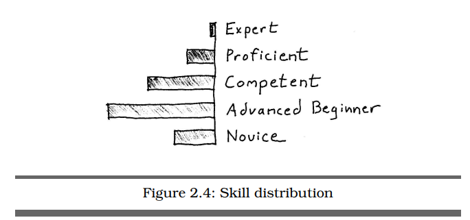

# TIL 2022-02-07

## 실용주의 사고와 학습

### 1장 개관

#### 다음 할 일

- 내 프로젝트에서 당면한 문제를 깊이 살펴보라. 다른 시스템들이 연관되어 있다는 것을 발견했나? 이들은 어디서 상호작용하는지? 상호작용하는 지점이 내가 보고 있는 문제와 연관이 있나?
- 내 문제를 유발한 주변 상황에서 뭔가 의미 있는 세 가지 찾기
- 항상 맥락을 고려하라.

### 2장 초보자에서 전문가에 이르는 여정

- 드라이퍼스 모델
  - 초보자 - 사전 경험 거의 없음
  - 고급 입문자 - 적절한 상황에서 조언 활용, 큰 맥락 이해 어려움
  - 중급자 - 문제를 직접 찾아 해결, 문제 해결 초점 어디에 맞출지 판단 어려움
  - 숙련자 - 자가 교정 가능, 사례 연구 통해 학습, 문제 상황 예측 가능, 패턴의 효과적 적용
  - 전문가 - 지식과 정보의 근원, 직관 활용, 범위 제한 후 집중해서 패턴 발견에 능숙

#### 다음 할 일

- 자신을 평가해보기. 나는 업무의 가장 중요한 기술에서 드라이퍼스 모델의 어디쯤 와있나? 내 현재 기술 수준에 영향을 줄 수 있는 방법 나열해보기
- 내가 초심자인 기술들이 어떤 것인지, 고급 입문자인 기술은 어떤 것인지 등 찾아보기 평가를 할 때 이차적 무능력의 가능성 염두하기
- 각각의 기술에서 다음 단계로 가려면 무엇이 필요한가?
- 프로젝트 팀에서 문제가 있을 때 드라이퍼스 모델을 알고 있었다면 피할 수 있었던 문제가 있는가? 나라면 어떻게 다르게 만들 수 있었을까?
- 내 팀 동료들은 이 여정의 어디쯤 있나? 그게 나에게 어떤 도움이 되는가?

### 3장 이것이 뇌다

- 분석을 통해 배우는 것만큼 종합을 통해서 배우라.
- 좋은 디자인을 위해 노력하라. 훨씬 더 나은 결과를 얻을 수 있다.
- 뇌를 믿음과 지속적인 단련으로 재구성하라.

#### 다음 할 일

- 내가 좋아하는/싫어하는 SW 프로그램 목록을 만들고 내 선택에 미학이 얼마나 영향을 미쳤는지 살펴보기
- 일과 가정에서 L모드를 쓰는 것들, R모드를 쓰는 것들의 균형이 잘 맞는가? 아니라면 이 상황을 바꾸기 위해 무엇을 할 수 있을까?
- 메모장을 늘 옆에 놔두고 사용하기
- 언제 어디서든 메모할 수 있는 도구 휴대하기
- 무언가를 배울 때 분석 대신 종합을 사용하도록 의식적으로 노력하기
- 키보드 모니터와 멀리 떨어져서 스프트웨어 설계해보기

### 4장 마음속 들여다보기

- 뇌를 더 많이 활용하고 싶다면 감각적인 경험을 늘려라.
- 날림 초안 쓰고 퇴고하기
- 짝 프로그래밍(한명은 R모드, 다른 한명은 L모드 사용)
- 메타포를 활용해 L/R모드 만나게 하기
- 무작위 병렬 배치로 메타포 만들기
- 시스템 메타포
  - 급여시스템과 우체국의 유사성
  - 분산된 편지함 - 급여를 받을 직원의 계좌
  - 편지 내용물 - 급여 액수
  - 배달 일정 - 급여 지급일
- 모닝페이지 기법
  - 기상 직후 최소 3쪽 정도 아무거나 종이에 글쓰기
- 문제 푸는 시각 바꾸기

#### 다음 할 일

- 더 많은 메타포 만들기
  - 유의어 사전 활용
  - [WordNet](https://wordnet.princeton.edu/)
- 모닝페이지 최소 2주 지속하기
- 짧고 재밌는 이야기 만들기
  - 연관 없는 것들 연관 짓거나 비슷한 점 찾기
- 어려운 문제에 직면할 때 다양한 감각 활용하기
- 늘 접하는 소재와 다른 종류의 책읽기
- 다른 장르의 영화, 음악, 색다른 휴가, 다른 종류의 커피 등
- 좋아하는 식당에서 한번도 시켜보지 않은 음식 먹어보기
- 문제를 이리저리 돌려보기. 뒤집었을 때 배우는 바가 있는지?

#### 시도해 볼 것

- 의식적으로 아침 일과 바꾸거나 다른 고정된 습관 바꾸기
- R 모드 강화할 수 있는 수업 듣기, 취미생활 등
- 늘 동기를 유발하고 진도에 대해 상의할 수 있는 친구 활용하기
- 현재 진행중인 프로젝트를 간단히 표현할 수 있는 메타포 생각해보기
- 내가 알고 있는 전문가가 가진 나에게 도움이 될 만한 기벽이 있는지?
- 내가 업무에서 사용하는 어휘 목록에 어떤 단어를 추가할 수 있을까?

### 5장 당신의 마음을 디버그하라

- 인지적 편향: 어떻게 생각이 나쁜 길로 이르는가
- 세대별 기호: 또래집단에 어떻게 영향을 미치는가
- 개인적 성향: 자신의 성격이 생각에 어떤 영향을 미치는가
- 하드웨어 버그: 뇌의 오래된 영역이 더 똑똑한 영역을 어떻게 덮어버리는가
- 상관관계 vs 인과관계
  - 단순 상관 관계는 무엇도 입증할 수 없다
  - 송전선 아래 사는 가정에 암환자가 많다 -> 송전선이 암을 유발한다(X)
  - 송전선 아래 집값이 싸다 -> 가난한 가정이 많다 -> 건강관리가 어렵다 -> 암환자 비율이 높다(원인 분석, 상관 관계 관찰과 다름)
  - 실세계의 인과 관계는 보통 `x가 y를 유발한다`처럼 단순하지 않다. `x가 y를 점화하면 그것이 x를 강화하고 다시 그것이 y를 강화한다`, `x나 y중 하나`, `x, y 모두`인 경우가 많다.
- 예외를 살펴보라: 드물다 != 결코 일어나지 않는다
- 기억보다 글로 쓴 것을 신뢰하라. 기억은 모두 읽기/쓰기와 함께 일어난다.
- 세대별 네가지 전형
  - 예언자: 비전, 가치, 결과 < 과정
  - 유목민: 자유, 생존, 명예, 제도 불신, 기업가적 마인드
  - 영웅: 공동체, 풍요, 수직구조 문화,
  - 예술가: 다원주의, 전문성, 의무, 순응주의적
- 나의 주장을 고집하지 말고 다양성 열어두기
- 사람마다 특성에 따른 다른 버그를 갖고 있다.
- 진화한 생명체답게 행동하라. 강렬한 감정이 밀려올 때 이를 그대로 드러내지 말고 지연시간 갖기.
- 나 자신에 대한 믿음, 정신모델 테스트하기
  - 어떻게 알았는가? 누가 말한 것인가? 구체적으로 어떤가?
  - 내가 하고 있는 일이 다른 사람에게 어떤 영향을 주는가?
  - 무엇이랑 비교하면? 누구랑 비교하면?
  - 항상 일어나는지? 예외는 없는지?
  - 내가 했다면 혹은 내가 한게 아니라면 어땠을까?
  - 뭐때문에 못하나?

#### 다음 할 일

- 나의 인지적 편견 열거하기. 어떤 것이 특별히 더 민감한가?
- 내 경력에서 거의 일어날 가능성이 없는 일이 얼마나 있었나? 지나고보니 실제로 그 가능성이 낮았나?
- 설계 회의에서 엔지니어의 기록 남기고 관리하기. 코딩에 관한 질문, 해답 등
- 나와 정반대의 타입인 것처럼 행동해보기. 세상이 어떻게 보이는가? 그런 사람들과 어떻게 교감할 수 있을까?
- 나와 정반대 성격의 사람과 어울려보기
- 위협을 인지하고 나서 초기 반응을 극복하는 데 얼마나 걸리나? 한번 생각해보고 나서 반응이 어떻게 달라지나?
- 충동에 따라 행동하더라고 즉각적으로 반응하지 말고 계획 세우기
- 충돌이 발생하면 기본적인 성격 유형, 세대별 가치관, 나의 편견, 다른 사람의 편견, 맥락, 환경을 고려해볼 것
- 나의 위치를 주의 깊게 고찰하기. 내가 아는 거은 어떻게 알게 되었는지, 왜 그렇게 생각하게 되었는지?

### 6장 의도적으로 배우라

- SMART 목표 설정
  - Specific 구체적인
  - Measurable 측정 가능한
  - Achievable 달성 가능한 목표
  - Relevant 의미 있는, 당면 과제에 적절한
  - Time-boxed 시간 제한이 있는
- 상세설명
  - S - 목표는 구체적이어야 함
    - 그냥 얼랭을 배우고 싶어 는 안됨
    - 얼랭으로 동적 콘텐츠 생성하는 웹 서버를 만들고 싶어
  - M - 목표는 측정 가능해야 달성 가능성이 올라감
    - 구체적이고 명확한, 실제 수치를 이용해 측정 할 수 있어야 함
    - 목표 측정이 어렵다고 느낀다면 목표가 아직 충분히 구체적이지 않은 것
    - 꾸준히 점진적인 진전을 측정할 것
    - 목적지나 지난 모든 길을 볼 필요 없음. 눈 앞의 두세걸음만 보면 됨
  - A - 달성 가능한 목표 잡기
    - 달성 불가한 목적/목표는 과녁이 될 수 없음
    - 적당한 수준을 선택할 줄 알아야 함
    - 다음주까지 새로운 언어로  Hello World! 찍기
    - 현재 자신의 위치를 고려해서 다음번 달성 가능한 목표 잡기
  - R - 의미 있는 목표 설정
    - 이게 정말 나에게 의미 있는 일인가?
    - 정말 나에게 중요하고 내가 열망하는 것인가?
    - 내가 제어할 수 있는 것인가?
    - 내가 하는 일과 관련이 있는가?
  - T - 목표의 마감기한 정하기
    - 마감일이 없으면 압박이 없어지고 결국 안하게 됨
    - 자주 작은 중간 목표 설정하고 기한 정하기
- 실용주의적 투자 계획 만들기
  - 구체적 계획 세우기(지금, 1주일, 1달, 분기, 반기, 1년, 3년, 5년, 10년)
  - 다각화하기(위험-수익 비율 고려하기, **모든 지식 투자는 가치가 있다**)
  - 적극적으로 수동적이지 않은 투자하기
  - 정기적으로 투자하기
- 스터디 그룹에서 서로 배우고 가르치기
- [Knowledge Hydrant: A Pattern language for study groups](https://www.industriallogic.com/papers/khdraft.pdf)
- SQ3R 독서법
  - Survey 훑어보기: 목차, 장 요약 보며 전체 개요 파악
  - Question 질문: 생각나는 질문 리스트 만들기
  - Read 읽기: 전체 읽기
  - Recite 낭송: 요약, 메모, 내 언어로 표현
  - Review 복습: 다시 읽기, 메모 확장, 동료와 토론
- **무언가를 배울 때 가장 단순하고 효과적인 기법은 그것을 가르쳐 보는 것이다.**

#### 다음 할 일

- 나에게 가장 중요한 목적 세가지 SMART 목표 수립하기
- 구체적인 목표 세우기 - 단기/장기
- 아직 탐험해본 적 없는 두가지 영역 추가해서 포트폴리오 다각화하기
- 두자에 헌신할 수 있는 주의 위해 시간 확복하기
- 포트폴리오 정기적으로 재평가하기
  - 달라진 점, 잘된 점, 잘 안된 점, 지금 무엇을 하면 좋을지
- 새로운 주제를 다른 사람에게 가르쳐보기. 가르치는 과정에서 무엇을 배웠나? 교육을 준비하는 과정에서 무엇을 배웠나?
- 언어 사용자 모임에 참여하기
- 모임 주최자에게 다음 모임에 내가 준비한 주제로 발표 제안하기
- 그게 어려우면 주제에 대해 기사 또는 블로그 쓰기

### 7장 경험 축적

- 만들기 위해 배우지 말고 배우기 위해 만들기
- 효율적으로 실패하고 거기서 더 나은 피드백 받기
- 문제가 잘 풀리지 않을 때는
  -  한번에 다룰 수 있는 크기로 작게 쪼개기
  -  이미 풀어본 문제 중에서 유사한 것 찾기
- 탐험적 환경 만들기
  - 실험할 자유
  - 안정된 상태로 되돌아가기
  - 작업 상태 어떤 시점이든 재생하기
  - 진전 입증 능력(피드백 받기)
- 소프트웨어 개발 스타터 키트
  - 버전 제어(git, svn)
  - 단위 테스트
  - 자동화
- 이너게임
  - 말로 기술을 가르치는 것은 어렵다
  - 지시가 아니라 발견을 통해 배우기
  - 상황적인 피드백 받기
  - 판단하지 말고 지켜본 후에 행동하기
- 디버깅 전에 현재 상태를 완전히 파악할것
  - 생각지 못한 에러 발생
  - 일단 손 떼고 에러의 원인, 진원지 상상해보기
  - 실제로 그곳에 가서 에러의 원인이 맞는지 확인
  - 다시 손 떼고 수정한 후에 에러 없이 테스트 코드 동작하는 것 상상하기
  - 테스트코드 잘 통과되는 상상을 했으면 상상한대로 수정하고 테스트 잘 돌아가는지 확인
- 성공의 느낌에 익숙해질 것.
- 전문가처럼 배우라

#### 다음 할 일

- 프로젝트에 안전망(버전 제어, 단위 테스트, 자동화) 구축하기
- 개인 학습 프로젝트에도 같은 안전망 구축하기
- 프로젝트를 안전하게 탐험할 수 있는 인프라와 습관 갖추기
- 막히는 상황에서는 **실패를 시도하라, 인지가 고쳐줄 것이다.**
- 실패를 계획하라. 실수해도 별 문제가 안되고 괜찮다.
- 전문가가 되기. 흉내만 내는 게 아니라 전문가 역할 맡기
- 전문가의 경험을 공유할 때 어떤 방법이 제일 좋을 지 생각하고 실제로 공유하기

### 8장 초점 관리하기

- 주의집중력 높이기
  - 명상하기
  - 뭔가 하려고 하지 말기
  - 미루기 vs 절이기
    - 하기 싫어서 딴짓 하는 거면 미루기
    - 흥미가 있는데 단지 막혔다고 느끼는 것이라면 절이는 중
- 지식 경영
  - 위키 사용
- 컨텍스트 최적화
  - 다중작업은 생산성을 심각하게 저하시킨다.
  - GTD(Getting Things Done)
    - 입력은 한번만 훏어볼 것
    - 각 일더미를 순서대로 처리
    - 머릿속에 할일 목록을 담지 말 것
  - 같은 컨텍스트에 대한 정보는 많이 유지할 수록 생산성이 높아진다.
  - 작업 초점 유지하기
    - 하나의 화면에는 같은 컨텍스트의 작업만 띄워놓기

#### 다음 할 일

- 매일 최대 20분 정도 정기적으로 명상 하기
- 정신적으로 절일 때 나만의 방법은? 다른 것도 시도해보기
- 정신 산란하게 하는 반복적인 것들에 산만해지지 않고 처리할 수 잇는 흐름을 만들 방법 생각해보기
- 내가 언제 가장 생산적인지 알아보고 그 시간에 주의를 빼앗는 것들 제거하기
- down 타임과 생각하는 시간 추적하기, 둘의 차이점 알기
- 더 쉽게 집중을 유지할 수 있도록 일에서 벗어나는 것을 더 어렵게 하는 환경 만들기
- 전문가는 어떻게 산란을 피하는지 관찰하기

### 9장 전문성을 넘어서

- 계획으로 시작하기 - 시간을 내서 전투에 임하라.
- **진짜 적은 실수하는 것이 아니라 아무것도 하지 않는 것이다.**
- 새로운 습관은 시간이 걸린다.
- 믿으면 사실이 된다.
- 작은 걸음으로 나아가라.
- 그냥 시작하라. 뭐부터 시작하는지는 중요하지 않다.
  - 책임을 져라. 왜? 어떻게? 나는 어떻게 아는지? 묻는것을 두려워하지 말고 모르겠다고 대답하는 것도 두려워하지 말자.
  - 컨텍스트를 유지하고 인터럽트를 피하는 데 도움이 되는 두가지를 지금 당장 하자.
  - 실용주의 투자 계획 만들고 SMART 목표 수립하기
  - 내가 일하는 분야에서 초보자~전문가 사이 어디에 있ㄴ는지, 어떻게 하면 더 진보할 수 있을지 파악하기
  - 골치 아픈 코드 -> 5가지 다른 방법으로 다시 짜보기
  - 실수를 더 많이 할 수 있는 계획을 짜고 실수에서 배우기
  - 생각을 여유 있게 하고 흐르게 하기
  - 미학과 부가적인 감각에 마음 열기
  - 블로그 쓰기
  - 독서 모임 시작하기